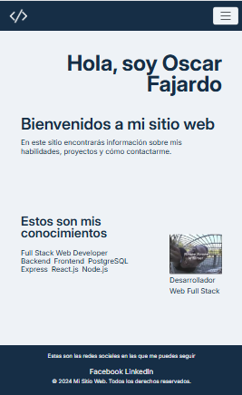

# Mi Portafolio

Proyecto desarrollado con **HTML**, **CSS** y **Bootstrap** que presenta mi portafolio personal, incluyendo información sobre mí, habilidades, proyectos y formas de contacto.

## 🚀 Tecnologías utilizadas

- HTML
- CSS

## 🌐 Demo

Puedes ver el proyecto en línea aquí:

**GitHub Pages:**  
https://svitak87.github.io/Entrega-1-Desarrollo-Web-Flex/index.html

## 📸 Vista previa




## 📁 Estructura del proyecto

```text
Entrega-1-Desarrollo-Web-Flex/
│
├── assets/
│   ├── logo.png
│   ├── renné-renné-le-filmer.png
│   └── vista-previa-portafolio.png
│
├── pages/
│   ├── contacto.html
│   ├── proyectos.html
│   ├── servicios.html
│   └── sobreMi.html
│
├── styles/
│   └── styles.css
│
├── index.html
└── README.md
```

## 📌 Características

- Diseño responsive.
- Estructura semántica con HTML.
- Estilos personalizados con CSS.
- Fácil de personalizar y ampliar.

## 👨‍💻 Autor

Hecho a mano con ❤️ por **Óscar**.